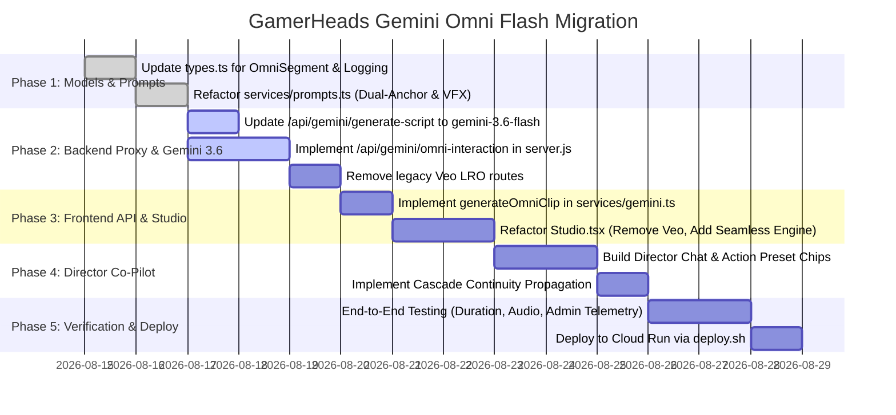

# GamerHeads: Gemini Omni Flash Technical Implementation Plan

> **Document Version:** 1.1  
> **Target Migration:** Veo 3.1 (`veo-3.1-generate-001`) ➔ Gemini Omni Flash (`gemini-omni-flash-preview`)  
> **Script & Analysis Model:** `gemini-3.6-flash` (Video Analysis, Script Generation, Director Co-Pilot)  
> **Avatar Model:** `gemini-3.1-flash-image` (Global Endpoint)  
> **Video & Vocal FX Model:** `gemini-omni-flash-preview` (Interactions API)  
> **Admin Dashboard:** 100% Retained & Enhanced (Datastore Logging, Telemetry, Recharts, Signed GCS URLs)  
> **Camera Mandate:** 100% Seamless, Unbroken One-Take Livestreamer Video (Zero Jump Cuts)  
> **Audio Mandate:** Vocal FX (VFX) Only (Speech, Laughs, Gasps, Whispers — No Music, No SFX)  
> **Duration Mandate:** $\sum \text{Durations} \equiv \text{Original Gameplay Video Duration}$  
> **Date:** August 2026

---

## 1. System Architecture & Scope

```
+----------------------------------------------------------------------------------------------------+
|                                    CLIENT BROWSER (REACT 19 SPA)                                   |
|                                                                                                    |
|   +-----------------------+   +------------------------+   +-----------------------------------+   |
|   |  ProjectForm.tsx      |   |  AvatarGenerator.tsx   |   |           Studio.tsx              |   |
|   |  - Exact Duration Calc|   |  - Locks Golden Anchor |   |  - Director Co-Pilot Chat Panel   |   |
|   |  - Format & Layout    |   |    (@Image0) in state  |   |  - Seamless Timeline (Zero Cuts)  |   |
|   |                       |   |                        |   |  - Cascade Continuity Re-aligner  |   |
|   +-----------------------+   +------------------------+   +-----------------------------------+   |
|               │                            │                                 │                     |
|               ▼                            ▼                                 ▼                     |
|   +────────────────────────────────────────────────────────────────────────────────────────────+   |
|   | services/gemini.ts (generateOmniClip, generateStreamerScript, stitchClipsServer)           |   |
|   | services/prompts.ts (constructOmniPrompt: @Image0 Identity + @Image1 Pose + VFX Audio Lock) |   |
|   | services/logging.ts (logEvent for Omni Flash, Gemini 3.6 Flash, Exports)                   |   |
|   +────────────────────────────────────────────────────────────────────────────────────────────+   |
|                                            │                                                       |
|                                            ▼                                                       |
|                        +──────────────────────────────────────────+                                |
|                        |        AdminDashboard.tsx (Recharts)     |                                |
|                        |  - Omni Flash Usage & Scorecards         |                                |
|                        |  - Generation Logs & Signed GCS URLs     |                                |
|                        +──────────────────────────────────────────+                                |
+--------------------------------------------------│-------------------------------------------------+
                                                   │ Authenticated HTTPS (Bearer / Basic Auth)
                                                   ▼
+----------------------------------------------------------------------------------------------------+
|                                  EXPRESS BACKEND (Cloud Run: server.js)                            |
|                                                                                                    |
|   +───────────────────────────+   +──────────────────────────────+   +─────────────────────────+   |
|   | /api/gemini/omni-interaction  | /api/gemini/stitch-clips     |   | /api/admin/stats        |   |
|   | - Interactions API Proxy  |   | - FFmpeg Lossless Concat     |   | - Datastore Querying    |   |
|   | - Dual-Anchor Handling    |   | - Zero-Seam Playback Stream  |   | /api/admin/signed-url   |   |
|   +───────────────────────────+   +──────────────────────────────+   +─────────────────────────+   |
+------------------│-------------------------------│--------------------------------│----------------+
                   │                               │                                │
                   ▼                               ▼                                ▼
+-------------------------------------+ +--------------------+ +-------------------------------------+
|   Vertex AI Multi-Model Stack       | | Google Cloud GCS   | | Google Cloud Datastore / Firestore  |
|   - gemini-3.6-flash (Script/Vision)| | - Customer Bucket  | | - GenerationLog Analytics Kind      |
|   - gemini-omni-flash-preview (Omni)| | - Video Archival   | | - Admin Telemetry Data              |
|   - gemini-3.1-flash-image (Avatar) | |                    | |                                     |
+-------------------------------------+ +--------------------+ +-------------------------------------+
```

---

## 2. File-by-File Technical Changes

### 2.1 `types.ts` — Data Models & State Contracts

```typescript
// 1. Update Segment Model for Omni Flash & Take Branching
export interface OmniTake {
  id: string;
  videoUrl: string;
  dialogue: string;
  prompt: string;
  createdAt: number;
}

export interface OmniSegment {
  id: number;
  startTime: string;           // e.g. "00:00"
  endTime: string;             // e.g. "00:07"
  duration: number;            // Dynamic (3 to 10 seconds)
  prompt: string;              // Action & micro-expression
  dialogue: string;            // Spoken text
  videoUrl?: string;           // Active take video URL
  takes?: OmniTake[];          // Multiple versions of this shot
  activeTakeIndex?: number;    // Selected take index
  isGenerating?: boolean;      // Loading indicator
  interactionId?: string;      // Omni Flash Interaction session ID
}

// 2. Logging & Admin Types
export interface LogEntry {
  userId: string;
  userEmail?: string | null;
  type: 'image' | 'video' | 'script' | 'export';
  model: string; // 'gemini-3.6-flash' | 'gemini-omni-flash-preview' | 'gemini-3.1-flash-image'
  timestamp: number;
  status: 'success' | 'failed';
  meta?: any;
}
```

---

### 2.2 `services/prompts.ts` — Prompt Engineering & Dual-Anchor Directives

#### Key Updates:
1. **Model Upgrades:** Set script analysis model to `gemini-3.6-flash`.
2. **Remove Veo Word-Count Constraints:** Delete rigid duration formulas (8–10 words for 4s, etc.).
3. **Strict VFX Audio Lock:** Enforce spoken dialogue and human vocal reactions only.
4. **Dual-Anchor Referencing:** Provide explicit references for identity (`@Image0`) and seamless pose continuation (`@Image1`).

```typescript
// Prompt Constructor for Gemini Omni Flash
export const constructOmniGenerationPrompt = (
    visualPrompt: string,
    dialogue: string,
    durationSeconds: number,
    gamingDevice: string,
    hasPreviousPose: boolean
): string => {
    let continuityDirective = '';
    if (hasPreviousPose) {
        continuityDirective = `
        CONTINUITY & MOTION INSTRUCTION:
        1. Character visual identity, facial features, hair, clothing, and background room MUST strictly match @Image0 (Golden Anchor).
        2. Movement and camera framing MUST start seamlessly from the exact physical pose, head tilt, and gesture shown in @Image1.
        3. Do not cut, reset, or jump. This is a single continuous camera take.
        `;
    } else {
        continuityDirective = `
        CHARACTER IDENTITY:
        Character visual identity, facial features, hair, clothing, and background room MUST strictly match @Image0 (Golden Anchor).
        `;
    }

    let deviceDirective = '';
    if (gamingDevice === 'Mobile (Vertical)') {
        deviceDirective = 'Streamer holds mobile phone vertically (portrait mode) with both hands. Thumbs tapping.';
    } else if (gamingDevice === 'Mobile (Horizontal)') {
        deviceDirective = 'Streamer holds mobile phone horizontally (landscape mode) with both hands.';
    } else if (gamingDevice === 'PC') {
        deviceDirective = 'Streamer interacts with keyboard and mouse on desk.';
    } else if (gamingDevice === 'Console') {
        deviceDirective = 'Streamer holds a gaming controller (gamepad) with both hands.';
    } else if (gamingDevice === 'Hands-free (No device)') {
        deviceDirective = 'Streamer is completely hands-free. No devices, controllers, or keyboards visible.';
    }

    return `
    IMAGE-TO-VIDEO GENERATION.
    ${continuityDirective}

    STRICT CAMERA RULES:
    - CAMERA: Tripod shot. Locked off. Absolutely no camera movement. No zoom. No pan. No tilt.
    - DURATION: Exactly ${durationSeconds} seconds.

    SUBJECT & ACTION:
    Gaming Streamer. ${deviceDirective} ${visualPrompt}

    STREAMER DIALOGUE & VOCAL FX (VFX):
    Streamer says: "${dialogue}".
    Lip sync must match speech.

    STRICT AUDIO CONSTRAINTS (MANDATORY):
    - AUDIO OUTPUT: Streamer Voice and Vocal Effects (VFX) ONLY.
    - Permitted: Spoken words, laughs, sharp gasps, excitement shouting, whispered reactions.
    - ABSOLUTELY NO background music.
    - ABSOLUTELY NO extraneous sound effects (no simulated game sounds, explosions, sirens).
    - ABSOLUTELY NO background room noise or echo.

    NEGATIVE CONSTRAINTS:
    No game UI, no overlays, no HUD, no scene cuts, no jump cuts, no camera pans, no transitions.
    `;
};
```

---

### 2.3 `server.js` — Backend Express Route Migration & Model Upgrades

#### 1. Upgrade Script Generation & Video Analysis to `gemini-3.6-flash`:
- In `/api/gemini/generate-script`: change `model: 'gemini-3.5-flash'` ➔ `model: 'gemini-3.6-flash'`.
- In `/api/gemini/analyze-script`: change `model: 'gemini-3.5-flash'` ➔ `model: 'gemini-3.6-flash'`.
- Maintain Google Search Grounding with `tools: [{ googleSearch: {} }]`.

#### 2. Deprecate Veo Endpoints:
- Remove `/api/gemini/generate-video`
- Remove `/api/gemini/video-operation`

#### 3. Implement `/api/gemini/omni-interaction`:
```javascript
// POST /api/gemini/omni-interaction
// Body: { prompt, goldenAvatarBase64, prevPoseBase64, aspectRatio, previousInteractionId, durationSeconds }
apiRouter.post('/gemini/omni-interaction', async (req, res) => {
    const { 
        prompt, 
        goldenAvatarBase64, 
        prevPoseBase64, 
        aspectRatio, 
        previousInteractionId, 
        durationSeconds 
    } = req.body;

    if (!prompt) return res.status(400).json({ error: 'prompt is required' });
    if (!goldenAvatarBase64) return res.status(400).json({ error: 'goldenAvatarBase64 is required' });

    try {
        const ai = getVertexAIGlobalClient();

        // Construct Multimodal Inputs
        const inputParts = [
            { type: 'text', text: prompt },
            {
                type: 'image',
                inlineData: {
                    mimeType: 'image/png',
                    data: goldenAvatarBase64 // @Image0
                }
            }
        ];

        // If continuing from previous clip, add @Image1 (Continuity Pose)
        if (prevPoseBase64) {
            inputParts.push({
                type: 'image',
                inlineData: {
                    mimeType: 'image/png',
                    data: prevPoseBase64 // @Image1
                }
            });
        }

        const interactionConfig = {
            model: 'gemini-omni-flash-preview',
            input: inputParts,
            response_format: {
                type: 'video',
                delivery: 'uri',
                aspect_ratio: aspectRatio === '9:16' ? '9:16' : '16:9'
            },
            generation_config: {
                video_config: {
                    task: prevPoseBase64 ? 'reference_to_video' : 'image_to_video'
                }
            }
        };

        if (previousInteractionId) {
            interactionConfig.previous_interaction_id = previousInteractionId;
        }

        console.log(`[Omni Flash] Creating interaction (duration target: ${durationSeconds || 6}s)...`);
        const interaction = await ai.interactions.create(interactionConfig);

        let videoUri = interaction.output_video?.uri || interaction.output_video?.gcsUri || null;
        let videoBase64 = interaction.output_video?.data 
            ? `data:video/mp4;base64,${interaction.output_video.data}` 
            : null;

        // If customer GCS bucket configured, copy video there
        if (GCS_BUCKET_NAME && videoUri && !videoUri.startsWith(`gs://${GCS_BUCKET_NAME}/`)) {
            try {
                videoUri = await copyVideoToBucket(videoUri);
            } catch (copyErr) {
                console.warn('[GCS] Copy to customer bucket failed, using original URI:', copyErr.message);
            }
        }

        res.json({
            interactionId: interaction.id,
            videoUri,
            videoBase64
        });
    } catch (err) {
        console.error('[Omni Flash] Interaction error:', err);
        res.status(500).json({ error: err.message || 'Omni Flash generation failed' });
    }
});
```

#### 4. Retain and Support All Admin Endpoints:
- `/api/log`: Retained, logging `gemini-omni-flash-preview` and `gemini-3.6-flash`.
- `/api/admin/stats`: Retained, querying Datastore with date filters and user filters.
- `/api/admin/signed-url`: Retained, generating 15-minute signed GCS URLs for authenticated file downloads.

---

### 2.4 `services/gemini.ts` — Client Service Updates

```typescript
// Script generation using gemini-3.6-flash
export const generateStreamerScript = async (
  info: GameInfo,
  onStatusUpdate?: (status: string, progress: number) => void,
  cachedInlineData?: { data: string, mimeType: string }
): Promise<ScriptResult> => {
  // ... video compression & inline data prep ...
  const result = await apiFetch('/api/gemini/generate-script', {
    method: 'POST',
    headers: { 'Content-Type': 'application/json' },
    body: JSON.stringify({
      prompt,
      inlineData: inlineData || null,
      videoMimeType: finalMimeType,
      searchGrounding: info.searchGrounding,
      gameUrl: info.url
    })
  });

  logEvent('script', 'gemini-3.6-flash', 'success');
  return result;
};

// Client service calling Omni Flash Interaction API
export const generateOmniClip = async (
    prompt: string,
    dialogue: string,
    durationSeconds: number,
    goldenAvatarBase64: string,
    aspectRatio: '16:9' | '9:16',
    gamingDevice: string,
    prevPoseBase64?: string,
    previousInteractionId?: string,
    signal?: AbortSignal
): Promise<{ videoUrl: string; interactionId: string }> => {
    const rawGoldenAvatar = goldenAvatarBase64.includes(',') 
        ? goldenAvatarBase64.split(',')[1] 
        : goldenAvatarBase64;
    const rawPrevPose = prevPoseBase64 
        ? (prevPoseBase64.includes(',') ? prevPoseBase64.split(',')[1] : prevPoseBase64)
        : undefined;

    const refinedPrompt = constructOmniGenerationPrompt(
        prompt,
        dialogue,
        durationSeconds,
        gamingDevice,
        !!rawPrevPose
    );

    const result = await apiFetch('/api/gemini/omni-interaction', {
        method: 'POST',
        headers: { 'Content-Type': 'application/json' },
        signal,
        body: JSON.stringify({
            prompt: refinedPrompt,
            goldenAvatarBase64: rawGoldenAvatar,
            prevPoseBase64: rawPrevPose,
            aspectRatio,
            durationSeconds,
            previousInteractionId
        })
    });

    logEvent('video', 'gemini-omni-flash-preview', 'success', { duration: durationSeconds });

    // Handle URI or Base64 return
    if (result.videoBase64) {
        return { videoUrl: result.videoBase64, interactionId: result.interactionId };
    }

    if (result.videoUri) {
        const downloadUrl = `/api/gemini/download-video?uri=${encodeURIComponent(result.videoUri)}`;
        return { videoUrl: downloadUrl, interactionId: result.interactionId };
    }

    throw new Error('Omni Flash completed but returned no video.');
};
```

---

### 2.5 `components/Studio.tsx` & `components/AdminDashboard.tsx`

#### Studio Refactor:
1. **Remove Veo 3.1 Selectors:** Remove `veoModel` buttons and `startingFrame` jump-cut reset toggle.
2. **Director Co-Pilot Panel:**
   - Chat input for targeted shot directing powered by `gemini-3.6-flash`.
   - 1-click Preset Action Chips (`[🔥 Hype Up]`, `[😱 Jump Scare]`, `[😂 Laugh]`, `[🤫 ASMR]`, `[🎮 Focus Face]`).
   - `[⚡ Cascade Continuity]` trigger to smoothly re-render downstream takes from updated shot ending pose.
3. **Seamless Multi-Take Management:** Store takes per shot while keeping the one-take stream continuous.

#### Admin Dashboard Verification:
- Add `gemini-omni-flash-preview` and `gemini-3.6-flash` to the Recharts activity trends and model usage visualizations.
- Ensure GCS signed URL generation works flawlessly with Omni Flash video outputs stored in GCS.

---

## 3. Phased Implementation Roadmap



---

## 4. Verification & Testing Checklist

- [ ] **Zero Jump Cuts:** Verify that stitched video plays as a single continuous livestream camera take without visual glitches between shots.
- [ ] **Scripting Model:** Verify that script analysis and video understanding use `gemini-3.6-flash`.
- [ ] **Identity Preservation:** Verify that Shot 5 looks identical in facial features, hair, clothing, and background to Shot 1 using `@Image0` Golden Anchor.
- [ ] **Audio Isolation (VFX Only):** Verify that audio track contains only streamer speech, laughs, gasps, or whispers — zero background music, zero fake SFX.
- [ ] **Exact Duration Matching:** Verify that $\sum \text{Durations}$ equals the exact duration of the uploaded gameplay video.
- [ ] **Director Co-Pilot:** Test directing a single shot (*"Make them laugh"*) and verify take generation in < 5 seconds.
- [ ] **Cascade Continuity:** Test modifying Shot 2 and clicking *Cascade Continuity* to confirm seamless flow through Shot 3 and 4.
- [ ] **Admin Dashboard:** Confirm `/admin` displays generation logs for `gemini-omni-flash-preview` and `gemini-3.6-flash`, with working signed GCS URLs and CSV exports.
- [ ] **Cloud Run Deployment:** Verify container builds and deploys cleanly using `./deploy.sh` (Mode 2).

---
*Technical Plan updated and ready for execution upon user authorization.*
