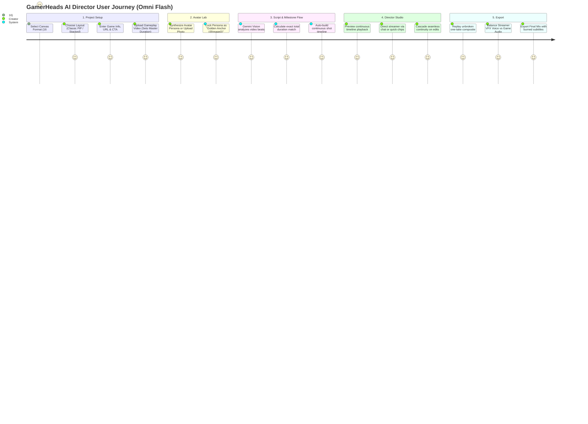

# GamerHeads: Gemini Omni Flash User Guide & Journey

> **Feature Version:** 2.0 (Gemini Omni Flash Upgrade)  
> **Target Engine:** Gemini Omni Flash (`gemini-omni-flash-preview`) strictly  
> **Camera Style:** 100% Seamless, Unbroken One-Take Streamer Video (Zero Jump Cuts)  
> **Status:** Proposed User Experience (Updated with Seamless Continuity Mandate)  
> **Reference Research:** [`docs/OMNI_MIGRATION_RESEARCH.md`](file:///usr/local/google/home/raynerseah/jetski/gamerhead/docs/OMNI_MIGRATION_RESEARCH.md)

---

## 1. Executive Summary: What’s Changing?

GamerHeads is migrating its video generation engine entirely to **Gemini Omni Flash** (`gemini-omni-flash-preview`) powered by Google's **Interactions API**. Veo 3.1 is completely deprecated and removed.

In previous versions, "jump-cut avatar resets" were introduced as a compromise to prevent visual decay caused by fragile frame-chaining. With Gemini Omni Flash **Dual-Anchor Referencing (`@Image0`)**, visual decay is solved at the architecture level. 

This enables GamerHeads to fulfill its true design vision: **A 100% seamless, unbroken, continuous one-take livestreamer camera shot** across the entire duration of the gameplay video — with **ZERO jump cuts**.

```
╔══════════════════════════════════════════════════════════════════════════════════════════════════════════╗
║                                        KEY UPGRADE HIGHLIGHTS                                            ║
╠══════════════════════════════════════════════════════════════════════════════════════════════════════════╣
║ 🎥 ZERO JUMP CUTS:           100% seamless, unbroken, continuous one-take livestream camera shot.        ║
║                             The old 'jump-cut avatar compromise' is completely eliminated.               ║
║ ⚡ Near-Instant Generation:  No more 60-90s polling waits; clips generate via stateful interactions.      ║
║ 🎙️ Voice & Vocal FX Only:    Audio locked strictly to streamer voice & vocal effects (VFX: laughs,      ║
║                             gasps, shouts, whispers). NO background music, NO extraneous SFX.           ║
║ ⏱️ 100% Video Duration Match: Total duration of all generated clips EXACTLY equates to the length of     ║
║                             the uploaded gameplay video (from 00:00 intro to final CTA closing).        ║
║ 🎨 Zero Character Drift:     "Golden Anchor" (@Image0) locks streamer face/room 100% across all cuts.    ║
║ 🌊 Cascade Re-Alignment:     Updating Shot 2 automatically cascades seamless motion continuation         ║
║                             downstream so the entire livestream remains an unbroken take.               ║
║ 💬 Targeted Director Co-Pilot: Direct streamer per-clip or project-wide via plain English chat.         ║
║ 🎯 Pure Omni Flash:          100% powered by Gemini Omni Flash — zero legacy model selector confusion.  ║
╚══════════════════════════════════════════════════════════════════════════════════════════════════════════╝
```

---

## 2. Before vs. After: Experience Comparison

| Experience Dimension | Old Workflow (Veo 3.1) | New Workflow (Gemini Omni Flash) |
| :--- | :--- | :--- |
| **Camera Experience** | ✂️ Compromised with artificial jump cuts & avatar resets | 🎥 **100% Seamless, Unbroken One-Take Livestream** |
| **Model Engine** | Veo 3.1 Standard & Fast | **100% Strictly Gemini Omni Flash** |
| **Generation Speed** | ⏱️ 45–90s per clip (Async LRO Polling) | ⚡ Fast (Stateful Turn-Based Interaction) |
| **Directing & Editing** | 📝 Static text edits; full manual re-renders | 💬 **Director Co-Pilot** (Conversational per-clip or full project) |
| **Audio Specification** | 🎙️ Sterile flat speech only | 🗣️ **Vocal FX (VFX) Only**: Spoken dialogue, gasps, laughs, shouts, whispers. **No music, no background SFX.** |
| **Visual Consistency** | ⚠️ Frame scraping caused face morphing by Shot 4 | 💎 **Golden Anchor (`@Image0`)**: Zero drift across the unbroken take |
| **Script Flexibility** | 📏 Strict word counts (e.g. exactly 10–13 words) | 🌊 **Natural Pacing**: Dynamic dialogue calibrated to gameplay beats (3s–10s) |
| **Duration Sync** | 📐 Approximate matching | ⏱️ **Strict 100% Timeline Match** ($\sum \text{Durations} \equiv \text{Video Length}$) |

---

## 3. The Seamless One-Take Livestream Engine

### Why Were There Jump Cuts Before?
In Veo 3.1, chaining video frames sequentially caused cumulative visual drift (faces distorted after 3–4 clips). As a workaround, the app forced periodic "Avatar resets", which created awkward jump cuts in the streamer's reaction video.

### How Gemini Omni Flash Eliminates Jump Cuts:
With **Dual-Anchor Referencing**, Gemini Omni Flash takes two references on every single turn:
1. **`@Image0` (The Golden Anchor):** The high-resolution avatar image locked in Avatar Lab. This permanently anchors facial features, hair, eye shape, lighting, and room background.
2. **`@InteractionState` (The Motion Continuity Anchor):** The exact ending physical pose, head angle, and gesture of the preceding segment.

```
[ Uploaded Gameplay Video: Exactly 42s ]
   │
   ├─ Segment 1 (7s): Omni Flash [@Image0 + Intro Prompt] ───────────► Streamer begins talking at desk
   │                                                                            │ (Seamless Ending Pose)
   ├─ Segment 2 (8s): Omni Flash [@Image0 + Prev State + Combat Beat] ─► Smoothly continues combat reaction
   │                                                                            │ (Seamless Ending Pose)
   ├─ Segment 3 (7s): Omni Flash [@Image0 + Prev State + Boss Shock] ──► Smoothly transitions to boss gasp
   │                                                                            │ (Seamless Ending Pose)
   ├─ Segment 4 (6s): Omni Flash [@Image0 + Prev State + Clutch Win] ──► Smoothly cheers in celebration
   │                                                                            │ (Seamless Ending Pose)
   ├─ Segment 5 (7s): Omni Flash [@Image0 + Prev State + Outro Call] ──► Smoothly delivers Call to Action
   │                                                                            │ (Seamless Ending Pose)
   ├─ Segment 6 (7s): Omni Flash [@Image0 + Prev State + Closing] ─────► Concludes at exactly 42.0s
   │
   ▼
[ Continuous Video Stitch ] ──► ONE UNBROKEN, SEAMLESS LIVESTREAMER TAKE (00:00 -> 42:00)
```

---

## 4. How Reworking & Directing Works with Seamless Continuity

### *"If a previous clip is changed, how do subsequent clips maintain continuity?"*

Because GamerHeads generates an **unbroken, continuous camera take**, changing an earlier clip naturally updates the streamer's ending pose at that timestamp. 

The Director Co-Pilot handles this with **Automated Cascade Re-alignment**:

```
[ User directs Shot 2: "React with a huge jump and scream when the boss drops!" ]
   │
   ▼
1. Shot 2 renders new Take B with intense physical reaction (~3-5s).
   │
   ▼
2. The Director Co-Pilot prompts: 
   "Shot 2 updated! Cascade seamless continuity to Shot 3 & 4?" [⚡ Cascade Continuity]
   │
   ▼
3. Clicking [Cascade Continuity] seamlessly propagates the new ending pose into subsequent shots 
   using their existing script prompts, preserving the unbroken one-take flow across the entire video!
```

- **Non-Destructive Versioning:** Your original takes (`Take 1`) are never overwritten. You can switch between `Take 1` and `Take 2` at any time.
- **Zero Seams:** When you export, the stitched video plays as one single continuous livestream camera without a single glitch or jump cut.

---

## 5. Duration Synchronization: 100% Video Alignment

The total sum of all streamer clip durations strictly equals the exact length of the imported gameplay video:

$$\sum_{i=1}^{N} \text{Duration}(\text{Shot}_i) \equiv \text{Total Gameplay Video Length}$$

1. **Opening Introduction (00:00):** Shot 1 always introduces the game title right as the gameplay begins.
2. **Action Milestones:** Intermediate shots synchronize physically with combat, milestones, or failures in the video.
3. **Closing CTA Delivery:** The final shot delivers the Call to Action (CTA) right up to the final second of the video.
4. **Zero Cut-offs / Overflow:** The streamer video and gameplay video start together and end together perfectly.

---

## 6. Audio Architecture: Vocal FX (VFX) Locked

The audio output from Gemini Omni Flash is locked strictly to **Streamer Voice & Vocal FX (VFX)**:

### What IS Heard:
- Spoken dialogue with accurate lip synchronization.
- Expressive human vocal reactions:
  - Laughing & giggling (`[Laughing]`)
  - Sharp gasps & intakes of breath (`[Gasping]`)
  - Shouting & hype cheering (`[Shouting]`)
  - Sarcastic scoffs & sighs (`[Sigh]`)
  - Intimate whispering (`[ASMR whisper]`)

### What is NOT Heard (Strictly Excluded):
- **NO background music** (prevents copyright strikes and clashing with game soundtracks).
- **NO extraneous sound effects** (no synthesized explosions, no fake sirens, no simulated game SFX).
- **NO room echo / background clutter**.

> This ensures the streamer vocal track is clean and studio-isolated, ready for perfect mixing with your uploaded gameplay audio via the Studio volume sliders.

---

## 7. The New End-to-End User Journey



---

### Step-by-Step Walkthrough

### 🎬 Step 1: Project Setup & Layout
1. **Choose Canvas Format:** `16:9 Landscape` or `9:16 Portrait`.
2. **Choose Streamer Layout:** `Classic PiP`, `Stacked Split-Screen`, or `Streamer Only`.
3. **Set Game Details:** Game Title, CTA, Gaming Device (`PC`, `Console`, `Mobile Vertical`, `Mobile Horizontal`, or `Hands-free`), and optional **Google Search Grounding** URL.
4. **Upload Gameplay Video:** The exact duration is measured and established as the strict master timeline length.

---

### 👤 Step 2: Avatar Lab (The Golden Anchor)
1. **Create or Upload Streamer:** Upload a reference photo or describe your streamer and generate with AI.
2. **Lock Golden Anchor (`@Image0`):** Locks face, hair, clothing, and room background permanently across the entire continuous video.

---

### 📝 Step 3: Script & Exact Duration Allocation
1. **Milestone Analysis:** Gemini vision scans the gameplay video to identify high-action moments.
2. **Duration Math:** The script breaks into segments (3s to 10s each) summing to the exact duration of the gameplay video.
3. **Natural Dialogue:** Dialogue flows naturally without artificial word counts, matching the pace of the action.

---

### 🎙️ Step 4: The "AI Streamer Director Studio"

```
┌─────────────────────────────────────────────────────────────────────────────────────────────┐
│ 👾 GamerHeads: Director Studio                           [Format: 16:9 PiP | Total: 42s]    │
├─────────────────────────────────────────────┬───────────────────────────────────────────────┤
│ 🎬 TIMELINE & LIVE PREVIEW                  │ 💬 DIRECTOR CO-PILOT (Selected: Shot 2)       │
│                                             │                                               │
│  ┌───────────────────────────────────────┐  │  🤖 Streamer: "Ready to roll! Let's beat this │
│  │                                       │  │               level!"                         │
│  │     [ Gameplay Background Video ]     │  │                                               │
│  │                                       │  │  👤 You: "React with a huge gasp and shout    │
│  │  ┌──────────────────┐                 │  │          'NO WAY' when the boss drops!"       │
│  │  │ 👤 Streamer PiP  │                 │  │                                               │
│  │  │ (Unbroken Take)  │                 │  │  ⚡ Co-Pilot: Rendering Take B... [Ready!]    │
│  │  └──────────────────┘                 │  │  [⚡ Cascade Continuity to Shot 3 & 4]        │
│  └───────────────────────────────────────┘  │                                               │
│                                             │  Quick Directing Action Chips (Shot 2):       │
│  TIMELINE TRACKS (SEAMLESS CONTINUOUS):     │  [🔥 Hype Up]  [😱 Jump Scare]  [😂 Laugh]   │
│  ├─ Gameplay: [===========================] │  [🤫 ASMR]     [🎮 Focus Face]  [🔄 New Take] │
│  └─ Streamer: [Shot 1: 6s][Shot 2: 7s][S3]  │                                               │
│               ▲ Active Focus: Shot 2        │  📌 Streamer Camera: 100% Unbroken One-Take   │
├─────────────────────────────────────────────┴───────────────────────────────────────────────┤
│ 🎚️ Audio Mix: Streamer Voice/VFX [ 120% ] ──●── Gameplay [ 30% ] ──●──                      │
│ [x] Burn Subtitles (Game Variety Style)      [ Preview Full Video ]   [ Export Final Mix 🚀]│
└─────────────────────────────────────────────────────────────────────────────────────────────┘
```

#### Key Directing Features:
1. **Seamless One-Take Camera:** Plays as one continuous, unbroken livestream recording without jump cuts.
2. **Targeted Shot Directing:** Select a shot, type an instruction, and get a new take.
3. **Quick Reaction Presets:** `[🔥 Hype Up]`, `[😱 Jump Scare]`, `[😂 Laugh]`, `[🤫 ASMR]`, `[🎮 Focus Face]`.
4. **Cascade Continuity:** When you update an earlier shot, 1-click propagates the new ending pose to downstream shots so the one-take flow remains continuous.
5. **Vocal FX Isolation:** Clear voice dialogue and vocal reactions with zero unwanted background music or SFX.

---

### 🚀 Step 5: Audio Balancing, Subtitles & Export
1. **Replay All:** Watch the complete composite video in the preview player as a seamless one-take livestream.
2. **Audio Sliders:** Adjust **Streamer Voice (VFX)** and **Gameplay Audio** independently with real-time gain balancing.
3. **Subtitles:** Toggle **Add Subtitles** to automatically burn proportional gaming subtitles onto the final video.
4. **Download Options:**
   - **Download Final Mix:** Full composite (Gameplay + Streamer PiP + Audio Mix + Subtitles) in 1080p MP4.
   - **Download Streamer Only:** Unbroken continuous streamer video track for external video editing.

---

## 8. Summary of Safeguards

1. **Zero Jump Cuts:** The streamer camera is 100% continuous and unbroken; the old jump-cut compromise is removed.
2. **Exact Duration Equality:** Total duration of all streamer segments strictly equals the imported gameplay video length ($\sum \text{Durations} = \text{Total Video Length}$).
3. **Golden Anchor (`@Image0`):** Eliminates visual degradation and face morphing across any video length.
4. **Clean Audio Isolation:** Audio is locked strictly to streamer dialogue and vocal effects (VFX) for clean mixing with game sound.
5. **Pure Omni Flash Engine:** No model selector; 100% powered by Gemini Omni Flash.

---
*Ready for final approval to begin implementation planning.*
