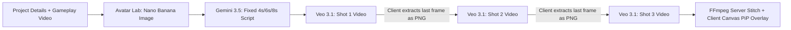

# GamerHeads: Gemini Omni Flash Migration & Architectural Research

**Document Version:** 1.0  
**Date:** August 2026  
**Status:** Research & Architectural Design  
**Target Repository:** `jetski/gamerhead`  

---

## 1. Executive Summary

This document captures the exploratory research, comparative analysis, and architectural design for transitioning **GamerHeads** from **Veo 3.1** (`veo-3.1-generate-001` / `veo-3.1-fast-generate-001`) to **Gemini Omni Flash** (`gemini-omni-flash-preview`).

While Veo 3.1 provides batch-rendered, discrete 4s/6s/8s video clips, Gemini Omni Flash introduces **turn-based, stateful conversational video and synchronized audio generation** via the **Interactions API**. This transition unlocks a fundamental shift from a rigid, form-driven rendering pipeline to a fluid **"AI Streamer Director"** experience, while resolving visual degradation, slow LRO polling, and speech-only audio constraints.

---

## 2. Context & Current Architecture Analysis

### Current GamerHeads Video Pipeline (Veo 3.1)


### Identified Pain Points in Current Codebase
1. **Fragile Client-Side Frame Scraping (`Studio.tsx:81-112`)**:
   - To connect Shot 1 to Shot 2, the client runs `extractLastFrame()` via a hidden HTML5 canvas.
   - Chaining frame snapshots causes progressive loss of facial fidelity and lighting drift over multiple shots (*"Note: Repeated use may degrade quality over time"*).
   - If Shot 1 is regenerated, downstream shots are flagged as stale (`isStale`) and must be manually remade.
2. **Artificial Script & Word-Count Constraints (`prompts.ts:13-42`)**:
   - `gemini-3.5-flash` is forced to calculate strict mathematical word counts (`8-10` words for 4s, `12-15` words for 6s, etc.) solely to satisfy Veo's rigid `4|6|8` second duration parameters.
3. **Speech-Only Audio Limitations (`prompts.ts:250`)**:
   - Veo requires: `"AUDIO: Speech only. NO MUSIC. NO SFX."` The streamer voice sounds sterile and isolated without ambient room sound, controller clicks, or keyboard clatter.
4. **Asynchronous Polling Latency (`server.js:712-780`)**:
   - Long-Running Operation (LRO) polling via `fetchPredictOperation` takes 30–90+ seconds per clip.

---

## 3. Gemini Omni Flash API Specification

Gemini Omni Flash is accessed via the **Interactions API** (`client.interactions.create` / `/v1beta/interactions`), built specifically for conversational media generation.

### Request Schema & Parameters

| Parameter | Type | Value / Options | Description |
| :--- | :--- | :--- | :--- |
| **`model`** | `string` | `gemini-omni-flash-preview` | Target model identifier. |
| **`input`** | `string` or `array` | Multimodal objects | Text prompts, up to 10 reference images, up to 3 reference videos (max 10s each). Inline base64 or Files API `uri`. |
| **`response_format.type`** | `string` | `"video"` | Target output modality. |
| **`response_format.aspect_ratio`** | `string` | `"16:9"` (default) or `"9:16"` | Output framing (Landscape vs. Portrait). |
| **`response_format.delivery`** | `string` | `"uri"` (recommended) or `"inline"` | Hosted download URI vs. Base64 data URL. |
| **`generation_config.video_config.task`** | `string` | `text_to_video`<br>`image_to_video`<br>`reference_to_video`<br>`edit` | Explicitly specifies generation workflow. |
| **`generation_config.seed`** | `integer` | e.g. `42` | Enables deterministic/reproducible generation. |
| **`previous_interaction_id`** | `string` | UUID | Passes conversation state for multi-turn editing. |

### Key Perimeters & Technical Limits
* **Duration Range:** 3 to 10 seconds per turn. (No explicit integer duration parameter like `duration_seconds`; duration is prompt-guided).
* **Resolution & FPS:** 720p at 24 FPS (cinematic frame rate).
* **Audio Capabilities:** Synchronized speech, vocal reactions (laughs, gasps, screams), and ambient SFX (keyboard/controller clatter, room tone) are natively embedded in the MP4 container.
* **Watermarking:** Automatically embeds invisible Google SynthID digital watermarks.
* **Prompt Constraints:** Standalone `negative_prompt` is unsupported in preview; negative constraints are embedded inside the text prompt. Function calling and tools are disabled for video generation.

---

## 4. Detailed Comparison: Veo 3.1 vs. Gemini Omni Flash

| Capability / Dimension | Veo 3.1 (`veo-3.1-generate-001` / `fast`) | Gemini Omni Flash (`gemini-omni-flash-preview`) | GamerHeads Impact |
| :--- | :--- | :--- | :--- |
| **API Paradigm** | Async LRO Polling (`fetchPredictOperation`) | Stateful Interactions API (`interactions.create`) | Eliminates polling loops; near-real-time generation. |
| **Visual Continuity** | Canvas frame capture (`extractLastFrame`) | Stateful Session Memory (`previous_interaction_id`) | Eliminates visual degradation between sequential shots. |
| **Audio Output** | Spoken dialogue only (No SFX / Ambiance) | Full synchronized sound design (Speech + SFX + Ambiance) | Authentic streamer room ambiance & natural reactions. |
| **Multi-Reference Ingestion**| 1 Starting Image only | Up to 10 Images (`@Image0`..`@Image9`), up to 3 Videos | Can pass Avatar + Gaming Room + Gameplay Clip simultaneously. |
| **Pacing / Durations** | Rigid `4s`, `6s`, or `8s` discrete buckets | Fluid `3s` to `10s` prompt-driven pacing | Removes rigid script word-count formulas. |
| **Editing Workflow** | Batch regenerate individual shot from scratch | Conversational prompt modifications ("Be more hype") | Transforms UX into an interactive director studio. |

---

## 5. Overcoming the >10s Duration & Visual Decay Challenge

### The Core Challenge
Gemini Omni Flash enforces a **10-second maximum per generation turn**. If a 60-second gameplay video requires chaining 8–10 consecutive turns, naive turn-after-turn chaining (*Shot 1 ➔ Shot 2 ➔ Shot 3 ➔ ...*) compounds latent artifacts, leading to facial distortion and character drift by Shot 5.

### Architectural Strategies to Eliminate Decay:

```
[ Uploaded Gameplay Video: 45s ]
   │
   ├── Segment 1 (7s): Omni Flash [Prompt + @Image0 Golden Anchor] ────────> Clip 1 (Native Audio)
   │
   ├── Segment 2 (8s): Omni Flash [Prompt + @Image0 Golden Anchor] ────────> Clip 2 (Native Audio)
   │
   ├── Segment 3 (6s): Omni Flash [Prompt + @Image0 Golden Anchor] ────────> Clip 3 (Native Audio)
   │
   └── ... Remaining segments
   │
   ▼
[ Cloud Run Backend: FFmpeg Concatenation (`/api/gemini/stitch-clips`) ]
   │
   ▼
[ Client Canvas PiP Compositor (`compositePipVideo`) + Adaptive Subtitle Burn-In ]
```

#### 1. Dual-Anchor Referencing (The "Golden Anchor")
Never rely solely on the previous video turn for identity. Every generation turn is permanently anchored to the original high-resolution avatar image:
* **`@Image0` (Golden Anchor):** The original 1K avatar generated from the Avatar Lab. Passed to **every single shot (1 to N)**.
* **`@Image1` (Continuity Reference):** Ending pose frame of the preceding clip.
* **Prompt Rule:**  
  > *"Generate a 7s clip where the character's facial features, hair, clothing, and background strictly match `@Image0`. Smoothly continue motion from the pose in `@Image1`."*
* **Mathematical Advantage:** Character drift remains **$O(1)$ constant** rather than $O(N)$ compounding.

#### 2. Authentic Streamer Cadence (Jump Cuts as a Feature)
Real livestream highlights and YouTube Shorts do not use single unbroken 60-second static camera takes. They use rapid, energetic jump cuts between gameplay beats:
* Cutting between 5s–8s shots resets the visual baseline to `@Image0` naturally.
* Viewers perceive these transitions as professional, high-energy editing (Twitch/YouTube style) rather than AI seam lines.

#### 3. Periodic Session Soft Resets
* When using `previous_interaction_id`, limit conversational chaining to **2–3 turns maximum**.
* At Shot 3 or 4, execute a **Soft Reset**: initiate a new interaction session anchored to `@Image0` with updated gameplay context.

#### 4. Hybrid Engine Option (Omni Flash + Veo 3.1)
* **Omni Flash (Default / 90% of use cases):** Snappy, conversational, audio-rich multi-shot director mode.
* **Veo 3.1 (Optional toggle):** Unbroken, continuous single-take long scenes using Veo's native first/last frame video extension.

---

## 6. Target User Experience (UX) Transformation

### Current UX (Linear Form):
`Step 1: Format` ➔ `Step 2: Layout` ➔ `Step 3: Details` ➔ `Avatar Lab` ➔ `Studio (Static Grid of Shot Boxes)` ➔ `Manual Render & Stitch`

### Proposed Future UX: "AI Streamer Director Studio"

```
┌────────────────────────────────────────────────────────────────────────┐
│ 👾 GamerHeads: Director Studio                                         │
├──────────────────────────────────┬─────────────────────────────────────┤
│ 🎬 LIVE PREVIEW / TIMELINE        │ 💬 DIRECTOR CO-PILOT CHAT           │
│                                  │                                     │
│  ┌────────────────────────────┐  │ > Streamer: "Ready to drop in!"     │
│  │                            │  │                                     │
│  │   [ Composited Video ]     │  │ User: "In Shot 2, react with more   │
│  │   Gameplay + Streamer PiP  │  │        shock when the boss appears." │
│  │                            │  │                                     │
│  └────────────────────────────┘  │ Omni: [Updating Shot 2 in ~4s...]   │
│                                  │                                     │
│  Timeline:                       │ Quick Directing Actions:            │
│  [Shot 1: 6s][Shot 2: 7s][Shot 3]│ [🔥 Hype Up] [🤫 ASMR] [😂 Laugh]   │
│                                  │ [🔄 Branch Alternative Reaction]    │
├──────────────────────────────────┴─────────────────────────────────────┤
│ 🎚️ Audio Mix: Streamer (120%) | Gameplay (30%) │ [Export Final Video] │
└────────────────────────────────────────────────────────────────────────┘
```

### Key UX Improvements:
1. **Conversational Director Co-Pilot:** Direct the streamer via natural dialogue (*"Be more sarcastic"*, *"Celebrate louder"*, *"Put on headphones"*).
2. **Instant Non-Destructive Branching:** Create alternate reactions without breaking downstream clips.
3. **Dynamic Pacing:** Script generation is freed from rigid word counts; dialogue flows naturally to match gameplay events.

---

## 7. Technical Implementation Blueprint

### 1. Backend Route: `/api/gemini/omni-interaction` (`server.js`)

```javascript
// POST /api/gemini/omni-interaction
apiRouter.post("/gemini/omni-interaction", async (req, res) => {
    const { prompt, avatarBase64, previousInteractionId, aspectRatio, task } = req.body;
    if (!prompt) return res.status(400).json({ error: "Prompt is required" });

    try {
        const ai = getVertexAIGlobalClient();
        
        const inputs = [{ type: "text", text: prompt }];
        if (avatarBase64) {
            inputs.push({
                type: "image",
                inlineData: { mimeType: "image/png", data: avatarBase64 }
            });
        }

        const interactionConfig = {
            model: "gemini-omni-flash-preview",
            input: inputs,
            response_format: {
                type: "video",
                delivery: "uri",
                aspect_ratio: aspectRatio === "9:16" ? "9:16" : "16:9"
            },
            generation_config: {
                video_config: {
                    task: task || (avatarBase64 ? "image_to_video" : "text_to_video")
                }
            }
        };

        if (previousInteractionId) {
            interactionConfig.previous_interaction_id = previousInteractionId;
        }

        const interaction = await ai.interactions.create(interactionConfig);
        
        res.json({
            interactionId: interaction.id,
            videoUri: interaction.output_video?.uri || null,
            videoBase64: interaction.output_video?.data ? `data:video/mp4;base64,${interaction.output_video.data}` : null
        });
    } catch (err) {
        console.error("[Omni Flash] interaction error:", err);
        res.status(500).json({ error: err.message });
    }
});
```

### 2. Frontend Service: `generateOmniClip` (`services/gemini.ts`)

```typescript
export const generateOmniClip = async (
    prompt: string,
    dialogue: string,
    goldenAvatarBase64: string,
    aspectRatio: "16:9" | "9:16",
    previousInteractionId?: string
): Promise<{ videoUrl: string; interactionId: string }> => {
    const refinedPrompt = `
    Gaming Streamer reaction shot.
    Character visual identity and background MUST strictly match @Image0.
    Streamer says: "${dialogue}".
    Action: ${prompt}
    `;

    const result = await apiFetch("/api/gemini/omni-interaction", {
        method: "POST",
        headers: { "Content-Type": "application/json" },
        body: JSON.stringify({
            prompt: refinedPrompt,
            avatarBase64: goldenAvatarBase64.replace(/^data:image\/[a-z]+;base64,/, ""),
            aspectRatio,
            previousInteractionId
        })
    });

    return {
        videoUrl: result.videoUri ? `/api/gemini/download-video?uri=${encodeURIComponent(result.videoUri)}` : result.videoBase64,
        interactionId: result.interactionId
    };
};
```

---

## 8. Phased Development Roadmap

```
Phase 1: Backend Integration
└── Add Omni Flash Interactions API proxy to server.js
└── Maintain backward compatibility with Veo 3.1 endpoints

Phase 2: Dual-Anchor Pipeline
└── Update services/prompts.ts to use Golden Anchor (@Image0) referencing
└── Implement Soft-Reset logic for multi-shot sequencing

Phase 3: UI/UX Modernization
└── Build Director Chat Co-Pilot inside components/Studio.tsx
└── Enable conversational branching and real-time shot tweaking

Phase 4: Hybrid Engine & Production Release
└── Add model toggle (Omni Flash vs. Veo 3.1 Standard/Fast) in Studio toolbar
└── Update deployment scripts and telemetry logging
```

---

## 9. Conclusion

Transitioning GamerHeads to Gemini Omni Flash provides immediate visual, acoustic, and latency advantages while elevating the app from a simple video generator to an **autonomous, conversational AI Streamer Production Studio**. Applying **Dual-Anchor Referencing** and **Jump-Cut Cadence** guarantees pristine visual fidelity across long-form video exports.
